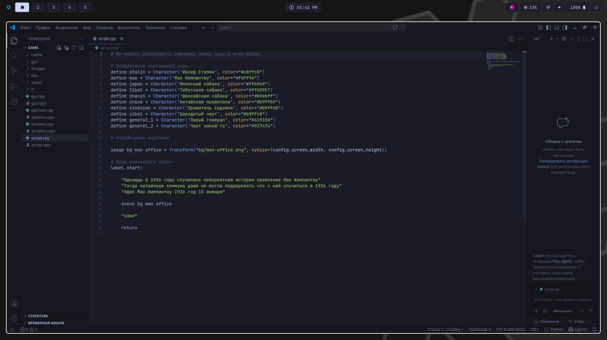
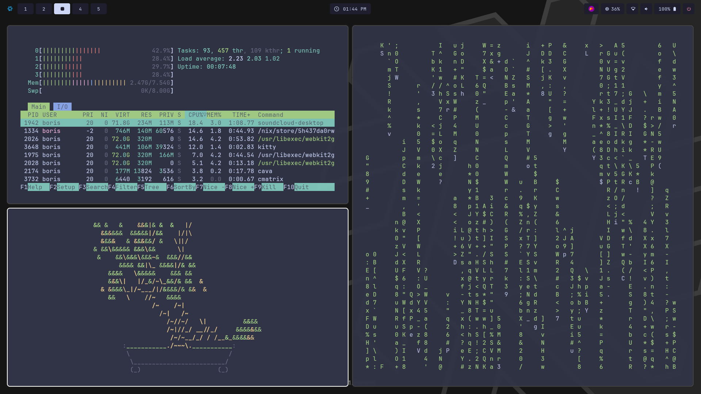
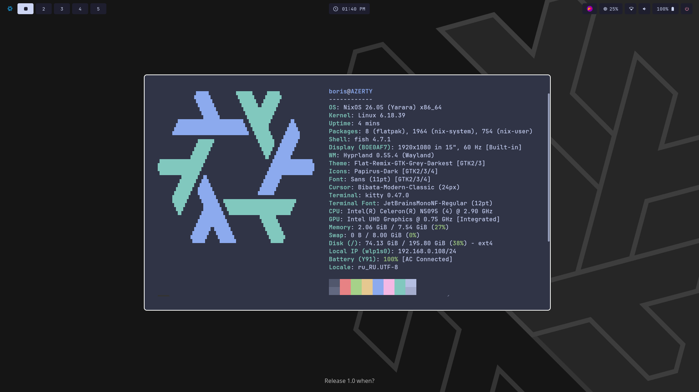

<<<<<<< HEAD
драйвера и всю хуйню пишите сами мне впадлу
=======
# My NixOS & Home Manager Configuration

Личная конфигурация **NixOS** и **Home Manager**, построенная на базе **Flakes**. Система разделена на системный уровень (NixOS) и пользовательское окружение (Home Manager). 

> ⚠️ **Важно:** Драйвера и всю хуйню пишите сами мне впадлу.

## 🖼️ Скриншоты (Ricing)







## 📁 Структура репозитория

* `flake.nix` — главная точка входа, описание зависимостей и системных конфигураций.
* `disk-config.nix` — разметка дисков с использованием `disko`.
* `configuration.nix` — базовые системные настройки NixOS.
* `hardware-configuration.nix` — аппаратная конфигурация (генерируется под конкретное железо).
* `packages.nix` — декларативный список системных и пользовательских пакетов.
* `nixos/` — папка с дополнительными модулями и настройками операционной системы.
* `home-manager/` — конфигурация пользовательского окружения (`kitty`, конфиги, темы).

## 📦 Список установленных пакетов (`packages.nix`)

### Основная хуйня (Системный софт)
* `vim`, `wget`, `curl` — базовый набор выживания в терминале.
* `wl-clipboard`, `cliphist`, `clipse` — менеджмент буфера обмена в Wayland.
* `wireplumber`, `pavucontrol` — управление звуком через PipeWire.
* `brightnessctl` — регулировка яркости экрана.
* `nwg-look`, `adwaita-icon-theme` — настройка GTK-тем и внешнего вида.
* `libnotify`, `dunst` — сервер уведомлений.
* `wlogout` — графическое меню завершения сеанса.
* `flatpak` — поддержка изолированных приложений.
* `unzip`, `zip` — работа с архивами.
* `steam-run`, `wine` — запуск Windows-софта и бинарников сторонних дистрибутивов.
* `qbittorrent` — торрент-клиент.
* `ocl-icd` — поддержка OpenCL.

### Графическое окружение (Hyprland Ecosystem)
* `waybar` — статус-бар.
* `rofi` — лаунчер приложений и меню.
* `hyprlock` — экран блокировки.
* `hypridle` — менеджер ожидания/сна.
* `hyprpaper` — управление обоями рабочего стола.

### Программки (GUI приложения)
* `firefox` — основной веб-браузер.
* `telegram-desktop` — мессенджер.
* `discord-ptb` — Discord Public Test Beta.
* `thunar` — графический файловый менеджер.
* `kitty` — эмулятор терминала.
* `flameshot` — создание скриншотов.
* `figma-linux` — дизайн-платформа Figma.
* `gnome-pomodoro` — таймер продуктивности.

### CLI чтобы повыебываться
* `cava` — консольный визуализатор аудиоспектра.
* `cmatrix` — падающий код в стиле Матрицы.
* `btop` — продвинутый монитор ресурсов.
* `hollywood` — симулятор взлома из голливудских фильмов.
* `genact` — симулятор бурной рабочей деятельности.
* `cbonsai` — генератор цифровых деревьев бонсай.

### Аудит Wi-Fi & Кибербезопасность
* `hashcat` — брутфорс хэшей с поддержкой GPU.
* `aircrack-ng` — классический инструмент для аудита беспроводных сетей.
* `hcxtools`, `hcxdumptool` — захват пакетов и хэндшейков WPA/WPA2.
* `iw` — утилита для конфигурации беспроводных интерфейсов.

### Игры
* `Prism Launcher` (из inputs) — кастомный лаунчер для Minecraft.
* `temurin-bin-25` — Java 25 для работы свежих версий и модов Minecraft.

### Среда разработки (Development)
* **Компиляторы и сборка:** `gcc`, `gnumake`, `clang`, `cmake`.
* **Языки и рантаймы:** `python3` (+ `pip`, `virtualenv`), `nodejs_22` (+ `corepack`), `julia`.
* **Java-стек:** `temurin-bin-21` (Java 21), `maven`, `gradle`.
* **IDE:** `vscode` (Visual Studio Code).

## 🚀 Как это запустить (на свой страх и риск)

### 1. Подготовка
Убедитесь, что у вас включены экспериментальные функции Nix (`flakes` и `nix-command`). Если нет, добавьте в `/etc/nix/nix.conf`:
```conf
experimental-features = nix-command flakes
```

### 2. Клонирование репозитория
```bash
git clone https://github.com ~/.config/nix-config
cd ~/.config/nix-config
```

### 3. Настройка под свое железо
Не забудьте перегенерировать или заменить `hardware-configuration.nix` под свой ПК:
```bash
nixos-generate-config --show-hardware-config > ./hardware-configuration.nix
```

### 4. Применение конфигурации

**Для всей системы (NixOS):**
```bash
sudo nixos-rebuild switch --flake .#AZERTY
```

**Для пользовательского окружения (Home Manager):**
```bash
home-manager switch --flake .#boris
```

>>>>>>> ac52e01 (update)
